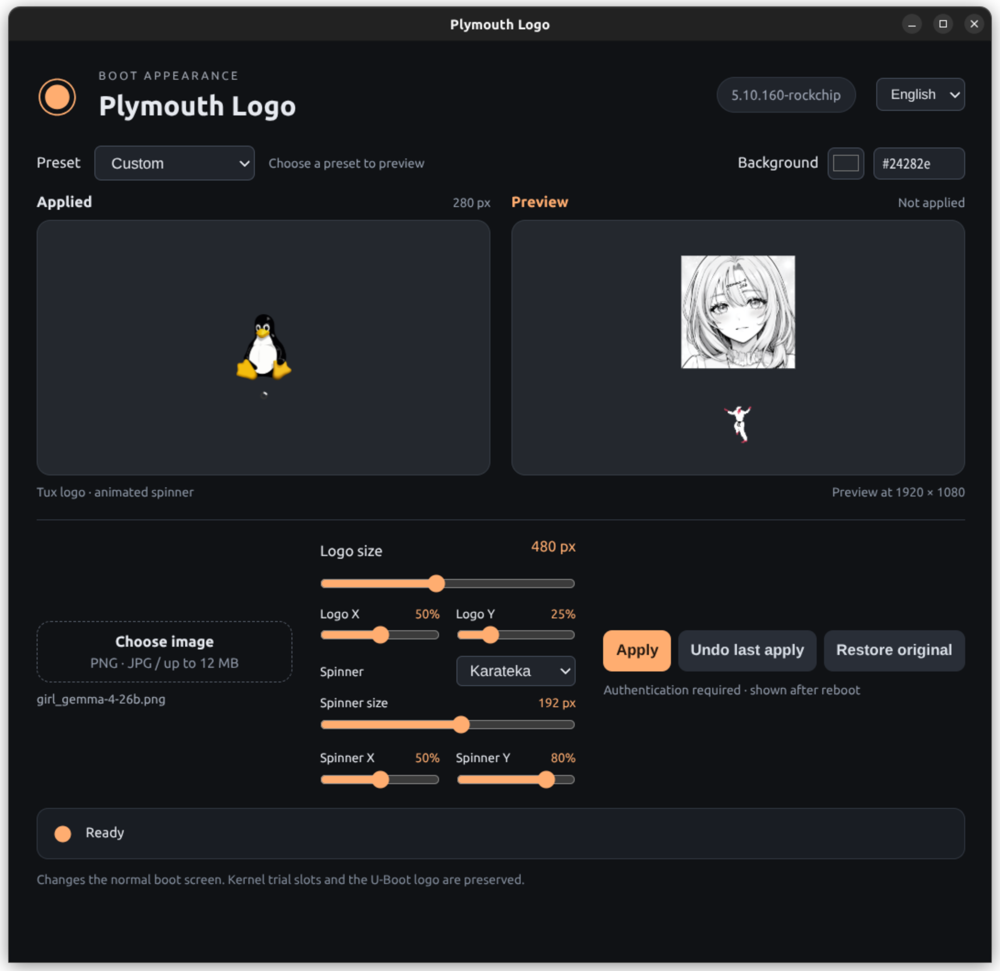

App for customizing Plymouth boot screen.

## Run

* Run `plymouth-logo`

## Build

```bash
make           # Build dist/plymouth-logo
make clean     # Remove the build output
```

## Append spinner

* Create `data/assets/spinners/my-spinner/` beside the executable.
* Add transparent PNG frames named `throbber-0001.png`, `throbber-0002.png`, etc. Use the same dimensions and consecutive numbers.
* Add `item.json` with a unique ID, display name, and playback FPS:

```json
{"id":"my-spinner","name":"My spinner","fps":24}
```
